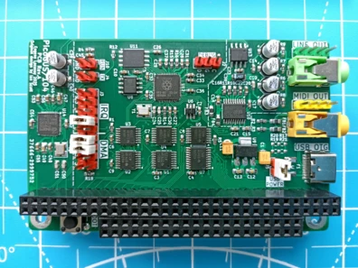

## PicoGUS/104
Gravis Ultrasound compatible sound card for IBM PC.

This is variant of [PicoGUS](https://picog.us/) v2.0 project by [Ian Scott](https://ianscott.org/) adapted for PC/104 bus. This variant also integrates SAM2695 MIDI synthesizer on board.

For details and firmware please follow this link: https://github.com/polpo/picogus
